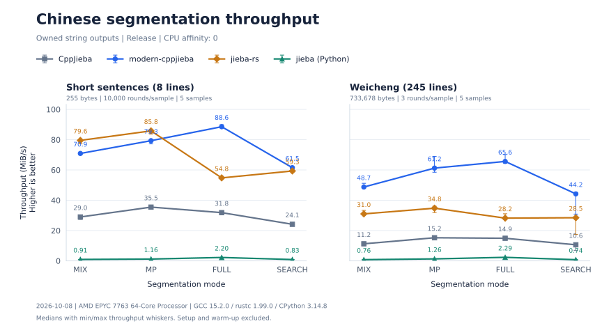

# modern-cppjieba

基于 [CppJieba](https://github.com/yanyiwu/cppjieba) 重写的 C++23 中文分词库，
以头文件形式提供，使用 `neo_cppjieba` 命名空间。

- MIX、MP、HMM、FULL、SEARCH 分词，支持用户词典。
- UTF-8、UTF-16、UTF-32 输入，提供词语及其在原文中的位置。
- token 视图、独立字符串和持有原文的分词结果。
- 可复用的工作区，适合连续处理多段文本。
- CppJieba、jieba-rs、Python jieba 三种分词规则，在编译期选择。

[应用示例](examples/README.md) · [性能对比](#性能对比) · [更新记录](CHANGELOG.md)

## 快速开始

构建示例需要 CMake 3.20+ 和支持 C++23 的编译器及标准库，包括 `<format>`、`<print>`。
CI 使用 GCC 14、LLVM 20 / libc++ 和 Visual Studio 2022，覆盖 Linux、macOS 和 Windows。

```sh
git clone https://github.com/AkrinW/modern-cppjieba.git
cd modern-cppjieba
cmake -S . -B build -DCMAKE_BUILD_TYPE=Release \
  -DBUILD_TESTING=OFF -DCPPJIEBA_BUILD_EXAMPLES=ON
cmake --build build --config Release --target jieba_basic_cut --parallel
./build/examples/jieba_basic_cut dict "我来到北京清华大学"
```

Visual Studio 生成器的程序路径为 `build/examples/Release/jieba_basic_cut.exe`。
平台配置见 [Linux CI](.github/workflows/cmake.yml) 和 [macOS / Windows CI](.github/workflows/platforms.yml)。

## 使用示例

```cpp
#include "neo/Jieba.hpp"

#include <print>

// Segment text with explicit dictionary and model paths.
int main() {
    const auto jieba = neo_cppjieba::Jieba{
        "dict/jieba.dict.utf8", "dict/hmm_model.utf8", "dict/user.dict.utf8"};
    for (const auto token : jieba.cut("我来到北京清华大学", neo_cppjieba::CutMode::MIX)) {
        std::println("{}", token.word);
    }
}
```

在仓库根目录运行，输出：

```text
我
来到
北京
清华大学
```

构造函数依次接收主词典、HMM 模型和用户词典路径，第三个参数传 `""` 可关闭用户词典。
路径相对于进程工作目录解析，Windows 路径使用 UTF-8。部署时将词典和模型文件一并提供。

## CMake 集成

将项目放入 `external/modern-cppjieba`，链接到应用目标：

```cmake
add_subdirectory(external/modern-cppjieba)
target_link_libraries(my_app PRIVATE neo_cppjieba::neo_cppjieba)
```

目标会设置头文件路径、C++23 标准和 MSVC 的 `/utf-8` 选项。
`BUILD_TESTING` 沿用父项目设置，只使用库时可在配置命令中传入 `-DBUILD_TESTING=OFF`。

安装头文件和词典：

```sh
cmake -S . -B build-library -DBUILD_TESTING=OFF
cmake --install build-library --prefix install
```

默认安装路径为 `install/include/neo/` 和 `install/share/cppjieba/dict/`。
手工集成时，将 `install/include` 加入头文件搜索路径，并启用 C++23。

## 分词模式

| `CutMode` | 说明 |
| --- | --- |
| `MIX` | 词典分词结合 HMM，识别未登录词 |
| `MIX_NO_HMM` / `MP` | 词典最大概率分词 |
| `SEARCH` | 在混合分词基础上补充较短词，适合搜索索引 |
| `SEARCH_NO_HMM` | 搜索分词，关闭 HMM |
| `FULL` | 输出词典匹配，结果可以重叠 |
| `HMM` | 使用隐马尔可夫模型分词 |

[Config.hpp](include/neo/Config.hpp) 中的 `compile_config::segmentation_style`
可选 `CPP`、`RUST`、`PYTHON`，默认值为 `CPP`。
三套规则分别参考 CppJieba、jieba-rs 0.11.0 和 jieba 0.42.1；
词典加载和用户词典行为以本库接口为准。具体差异见 [Rust 对比](benchmark/RUST.md) 和 [Python 对比](benchmark/PYTHON.md)。

## API

| 入口 | 结果 |
| --- | --- |
| `cut(text, mode)` | 借用原文的 token 视图及位置 |
| `cut_owned(string, mode)` | 持有原文和位置的结果 |
| `cut_strings(text, mode)` | 每个词独立存储的字符串数组 |
| `cut_with_workspace(text, mode, workspace)` | 复用工作区，返回借用原文的结果 |
| `cut_into(text, mode, out, workspace)` | 将位置或字符串写入调用方数组，复用其容量 |
| `cut_each(text, mode, emit, workspace)` | 通过返回 `void` 的回调逐词接收 token |
| `cut_runes(runes, mode)` / `cut_runes_into(runes, mode, out, workspace)` | 对已解码码点分词，输出 `WordRange` |

token 的 `word` 是原文视图，请在原文修改或销毁前完成使用。
需要长期保存结果时，可用 `cut_owned` 或 `cut_strings`；
`cut_owned` 的结果移动后，应重新获取 token 视图。

位置使用半开区间 `[begin, end)`。`position.source` 按原文编码单元计数，
UTF-8 对应字节偏移；`position.runes` 按 Unicode 码点计数。

批量处理可复用 `Workspace` 和输出数组。每个并发或嵌套调用独占一个工作区，输入和输出使用独立存储。
[应用示例](examples/README.md) 包含批量处理、搜索高亮、词频统计和结果所有权的完整程序。

容量类型配置见 [Config.hpp](include/neo/Config.hpp)，默认采用 32 位索引和偏移。
输入及词典规模须在所选类型的容量范围内，容量检查在 Debug 构建中执行。
修改配置后，所有使用本库的编译单元须采用同一配置重新编译。

## 性能对比

<!-- benchmark:start -->

数据来自 [GitHub Actions](https://github.com/AkrinW/modern-cppjieba/actions/runs/37739643166)，测试日期：2026-10-08。
测量提交：[`2341655`](https://github.com/AkrinW/modern-cppjieba/commit/23416552774103625fa229fb981cb7cb467eca16)。
各实现使用同一主词典和 HMM 模型，关闭用户词典；modern-cppjieba 使用 `CPP` 规则。



吞吐量单位为 MiB/s，越高越好。曲线取各样本的中位数，误差线表示最小、最大吞吐量。
各路径均返回独立字符串，计时覆盖分词、字符串构造和释放；语料读取、词典加载和预热在计时前完成。

- 环境：GitHub 托管 `ubuntu-24.04`，AMD EPYC 7763 64-Core Processor，绑定 CPU 0。
- 工具链：GCC 14.2.0（`-O3 -DNDEBUG`）、rustc 1.94.0（`opt-level=3`）、CPython 3.12.15。
- 比较版本：jieba-rs 0.11.0、Python jieba 0.42.1。
- 语料 `testlines`：8 行、255 字节，每样本 10,000 轮，共 5 个样本。
- 语料 `weicheng`：245 行、733,678 字节，每样本 3 轮，共 5 个样本。

不同实现的分词规则存在差异，词序列差异计数保存在数据快照中。
共享 runner 的耗时会有波动，图表仅代表这次测量。

[测试数据](docs/benchmarks/snapshot.json) · [复现与 CI 更新方法](benchmark/README.md)

<!-- benchmark:end -->

## 开发

```sh
cmake -S . -B build-tests -DCMAKE_BUILD_TYPE=Debug -DBUILD_TESTING=ON
cmake --build build-tests --config Debug --parallel
ctest --test-dir build-tests -C Debug --output-on-failure
```

启用单元测试时，CMake 会获取 GoogleTest。比较程序使用的依赖和初始化命令见 [deps/README.md](deps/README.md)。

| CMake 选项 | 默认值 | 作用 |
| --- | --- | --- |
| `BUILD_TESTING` | 顶层 ON；子项目未预设时 OFF | 构建单元测试 |
| `CPPJIEBA_BUILD_EXAMPLES` | OFF | 构建应用示例 |
| `CPPJIEBA_BUILD_LEGACY_TESTS` | OFF | 增加原版 CppJieba 回归测试，要求启用单元测试 |
| `CPPJIEBA_BUILD_BENCHMARKS` | OFF | 构建 benchmark |
| `CPPJIEBA_BUILD_RUST_BENCHMARKS` | OFF | 增加 Rust 比较，要求启用 benchmark |

公共头文件位于 `include/neo/`，`detail/` 为内部实现。
单元测试位于 `test/unittest_neo/`，性能测试位于 `benchmark/`，格式化及静态分析脚本位于 `tools/`。

## 许可证

[MIT License](LICENSE)。本项目基于 [CppJieba](https://github.com/yanyiwu/cppjieba)，
参考了 [jieba](https://github.com/fxsjy/jieba) 和 [jieba-rs](https://github.com/messense/jieba-rs)。
随库分发的 GTL 使用其 [独立许可证](include/neo/third_party/gtl/LICENSE)。
